### `git rebase` – Reescribiendo para mayor claridad

Rebasing es otra técnica poderosa en Git que difiere significativamente de merging. La principal diferencia entre merging y rebasing es cómo integran los cambios. Mientras que `git merge` integra los cambios de una rama en otra, `git rebase` mueve o combina una secuencia de commits a un nuevo commit base.

En el contexto de la colaboración en equipo, el rebasing se utiliza para mantener un historial de proyecto lineal, lo que simplifica la depuración y facilita las revisiones de código. Sin embargo, el rebase viene con su parte de complejidades y trampas, y generalmente es mejor usarlo en circunstancias específicas.

Antes de sumergirnos en el tutorial práctico, entendamos cómo funciona `git rebase` a un alto nivel. La utilidad principal del rebasing es colocar los cambios de la feature branch en la parte superior de otra rama.

Por ejemplo, considera las siguientes ramas:


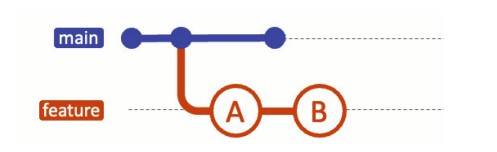

Después de hacer rebase de la feature branch sobre main, tu rama podría verse así:

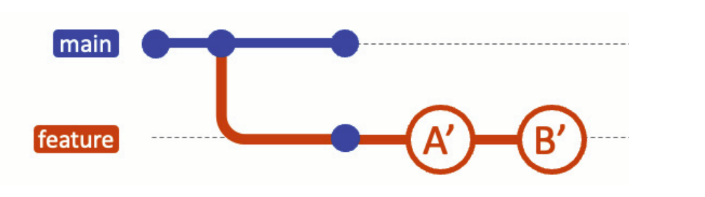

Finalmente, puedes fusionarte de nuevo a main, en cuyo caso se puede realizar una fusión fast-forward:

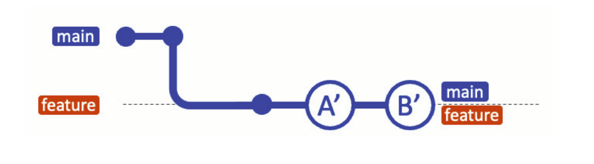

#### Pasos prácticos para `git rebase`

Tomemos un ejemplo práctico con una rama **main** y una **new-feature branch**. Aquí te mostramos cómo realizar rebase:

```bash
# Inicializar un nuevo repositorio
$ mkdir prueba-git-rebase
$ cd prueba-git-rebase
$ git init

# Agregar y commitear README.md inicial a main
$ echo "# Mi projecto rebase " > README.md
$ git add README.md
$ git commit -m "Commit inicial en el main"

# Crear y cambiar a una nueva rama 'new-feature'
$ git checkout -b new-feature

# Hacer algunos cambios, agregarlos y commitearlos
$ echo "Esta es una nueva caracteristica" >> NewFeature.md
$ git add NewFeature.md
$ git commit -m "Se agrega una nueva caracteristica"
```

En este punto, tu historial de ramas puede verse algo así:


Ahora, digamos que se han agregado nuevos commits a **main** mientras trabajabas en **new-feature**:

```bash
# Cambiar de nuevo a 'main' y agregar nuevos commits
$ git checkout main
$ echo "Actualiza el proyecto" >> Updates.md
$ git add Updates.md
$ git commit -m "Se actualiza main"
```

Tu gráfico de commits ahora diverge:


Ahora, haz rebase de **new-feature** sobre **main**:

```bash
# Cambiar a 'new-feature' y hacer rebase sobre main
$ git checkout new-feature
$ git rebase main
```

Veamos cómo se ve ahora:

```bash
$ git log --graph --oneline
* 43ea59e (HEAD -> new-feature) Esta es una nueva caracteristica
* 16e1878 (main) Se actualiza main
* 3021494 Initial Commit inicial en el main
```

Después de esto, tus ramas se verán como sigue:

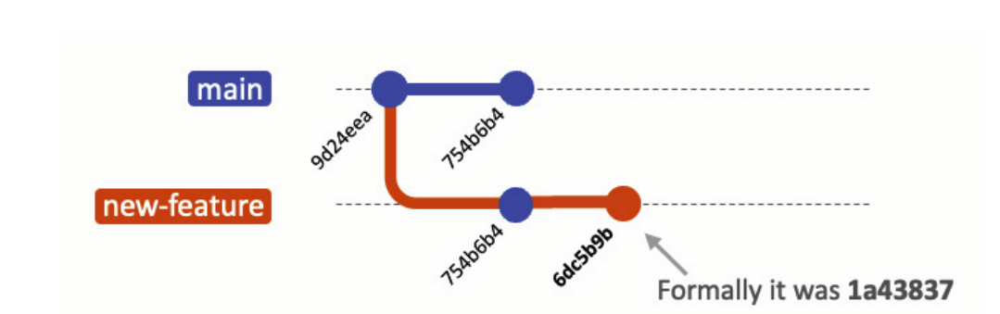

Ahora es el momento de fusionar y completar el proceso de `git rebase`:

```bash
# Cambiar a 'main' y realizar una fusión fast-forward
$ git checkout main
$ git merge new-feature
```

Cuando se realiza una fusión fast-forward, las HEADs de las ramas **main** y **new-feature** serán los commits correspondientes, como se muestra:

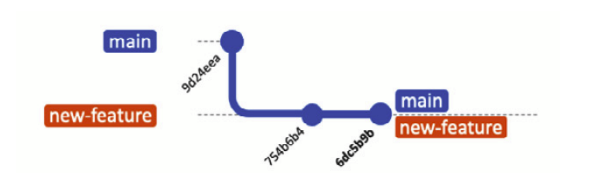

#### ¿Por qué el rebasing es poderoso en DevOps y colaboración en equipo?

La principal ventaja del rebasing en una cultura DevOps es que resulta en un historial de proyecto mucho más limpio que el merging. Los historiales más limpios son más fáciles de depurar, más simples de entender y tienen más sentido lógico para los desarrolladores que se unen al proyecto en una fecha posterior.

Aquí tienes algunos beneficios:

- **Historial lineal:** Es más fácil de entender que el historial no lineal creado por `git merge`.
- **Depuración simplificada:** Con un historial más limpio, rastrear cuándo se introdujo un error en particular se vuelve más fácil.
- **Higiene del código:** El rebasing te anima a aplastar commits de corrección o dividir commits más grandes, haciendo que tus cambios sean más comprensibles en comparación con los otros desarrolladores.

#### Las precauciones y trampas del `git rebase`

Hay reglas de oro a seguir: no hagas rebase en ramas públicas (de equipo). Una de esas reglas cardinales es evitar hacer rebase en ramas públicas. El rebase puede ser una gran herramienta para limpiar una feature branch, pero cuando se realiza en ramas que están disponibles públicamente, puede convertirse en un desastre.

Aquí están las cosas a considerar cuando uses `git rebase`:

- **Conflictos para los colaboradores:** Imagina que has hecho rebase en una rama pública y has enviado los cambios. Otros desarrolladores que ya han descargado la versión antigua de la rama ahora tienen un historial divergente. Cuando intenten enviar sus cambios, Git rechazará el push, obligándolos a reconciliar los historiales. Esto crea trabajo extra y aumenta la probabilidad de conflictos de merge.
- **Fusiones complejas:** Después de que una rama pública ha sido rebased y se ha alterado el historial, fusionarla con otras ramas puede convertirse en un verdadero desafío. Debido a que Git usa el historial de commits para determinar cómo integrar cambios, modificar ese historial puede hacer que la fusión sea mucho más complicada de lo necesario.
- **Pérdida de contexto:** El rebase puede aplastar commits juntos o cambiar su orden, lo que puede resultar en una pérdida de contexto para esos cambios. Esto hace que la depuración sea más difícil y puede complicar la tarea de entender el proceso de desarrollo que llevó a la base de código actual.

El rebasing puede ser complejo y arriesgado, especialmente para desarrolladores inexpertos. En los peores escenarios, podrías tener que resolver muchos conflictos, lo que lleva a errores y bugs si no se hace con cuidado.

Al comprender y utilizar `git merge` y `git rebase`, puedes manejar prácticamente cualquier situación que requiera combinar diferentes líneas de desarrollo. Cada uno tiene su lugar en un comando de Git, y entender cuándo usar cada uno es la clave para mantener una base de código limpia y comprensible, algo que es altamente valioso en el mundo de DevOps.


### `git cherry-pick`- Selección de commits específicos

Una de las herramientas más flexibles en los comandos de Git es el comando `git cherry-pick`. Mientras que los métodos de merge anteriores se usaban principalmente para integrar ramas enteras, `git cherry-pick` te permite seleccionar commits específicos de una rama y aplicarlos a otra rama. Este método puede ser increíblemente útil cuando necesitas aplicar solo algunos cambios específicos sin tomar todas las modificaciones de una rama diferente.

Imagina que tienes dos ramas, **main** y **feature**. Te das cuenta de que uno o dos commits de la rama **feature** deberían moverse a **main**, pero no estás listo para fusionar toda la rama. El comando `git cherry-pick` te permite hacer precisamente eso:

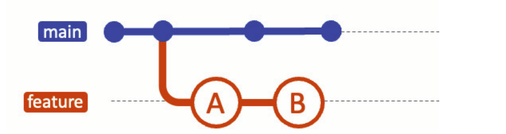

Puedes cherry-pick los cambios de un commit específico en la rama **feature** y aplicarlos a **main**. Esta acción creará un nuevo commit en la rama **main**:

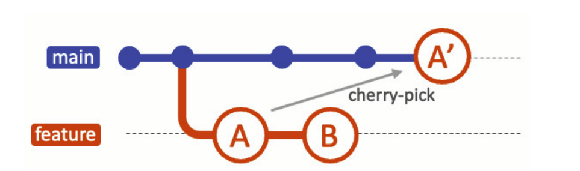


#### Pasos prácticos para cherry-picking

Ahora repasemos los pasos prácticos para cherry-picking de cambios y fusionarlos en una rama. Cada commit agrega un archivo a cada uno de ellos. Tomemos algunos de esos commits y fusionémoslos en **main**. Primero, agregamos los archivos:

```bash
# Inicializar un nuevo repositorio
$ mkdir prueba-cherry-pick
$ cd prueba-cherry-pick
$ git init

# Agregar y commitear README.md inicial a main
$ echo "# Mi Projecto" > README.md
$ git add README.md
$ git commit -m "Commit inicial"

# Crear y cambiar a una nueva rama 'add-base-documents'
$ git checkout -b add-base-documents

# Hacer cambios y commitearlos
# Agregar CONTRIBUTING.md
$ echo "# CONTRIBUTING" >> CONTRIBUTING.md
$ git add CONTRIBUTING.md
$ git commit -m "Add CONTRIBUTING.md"

# Agregar LICENSE.txt
$ echo "LICENSE" >> LICENSE.txt
$ git add LICENSE.txt
$ git commit -m "Add LICENSE.txt"

# Echa un vistazo al log de la rama 'add-base-documents'
$ git log add-base-documents --graph --oneline
* 02ee2b4 (HEAD -> add-base-documents) Add LICENSE.txt
* a80e8ad Add CONTRIBUTING.md
* cfb060a (main) Commit inicial
```

Ahora, las ramas se ven como las del siguiente diagrama:

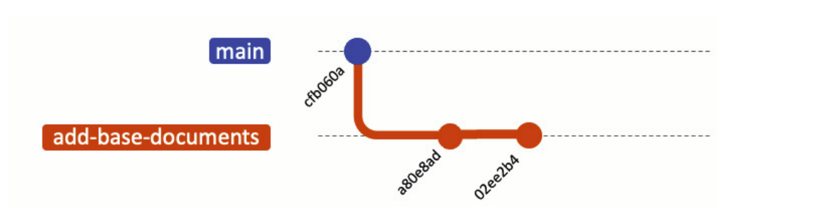

Ahora, solo elijamos el commit `a80e8ad` y pongámoslo en la rama **main**. Reemplaza el valor del hash en tu entorno:

```bash
# Ahora cambia de nuevo a la rama 'main' y cherry-pick el commit
$ git checkout main
$ git cherry-pick a80e8ad
[main 9a36741] Add CONTRIBUTING.md
Date: Sun Oct 29 16:04:56 2023 +0900
1 file changed, 1 insertion(+)
create mode 100644 CONTRIBUTING.md

# Veamos el log de la rama 'main'
$ git log --graph --oneline
* 9a36741 (HEAD -> main) Add CONTRIBUTING.md
* cfb060a Commit inicial
```

Después de que hayas realizado con éxito el cherry-pick del commit, se agregará un nuevo commit a tu rama actual (**main** en este ejemplo) y contendrá los cambios del commit cherry-picked. Ten en cuenta que el nuevo commit tiene los mismos cambios pero un valor de hash de commit diferente:

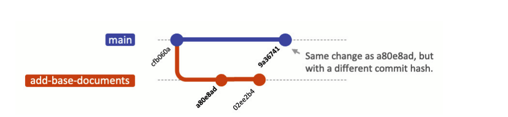


#### ¿Por qué es útil `git cherry-pick` en DevOps y colaboración en equipo?

El desarrollo en equipo requiere un desarrollo flexible. `git cherry-pick` es un comando útil en entornos de codificación colaborativa, que permite a los equipos integrar cambios selectivamente y mantener la integridad del código.

Veamos qué valor puede ofrecer el cherry-picking:

- **Integración selectiva:** Permite mover correcciones de errores específicas o características en producción sin tener que mover todos los cambios de una rama de desarrollo.
- **Reversión fácil:** Si algo sale mal, solo necesitas revertir un pequeño cambio en lugar de una fusión de rama completa.
- **Historial limpio:** Mantiene tu historial de Git ordenado al incluir solo commits relevantes, lo que facilita su lectura y comprensión.

`git cherry-pick` ofrece un alto nivel de precisión para integrar cambios entre ramas. Te permite seleccionar exactamente qué commits incluir, proporcionando un control granular sobre tu historial de proyecto. Esto lo convierte en una herramienta invaluable para cualquier ingeniero DevOps que busque un flujo de trabajo de control de versiones flexible y eficiente.


Después de explorar las diversas estrategias de fusión en Git, podrías preguntarte: "¿Qué método debería usar?" La respuesta, como en la mayoría de las cosas en ingeniería, es "depende". Varios factores entran en juego al determinar qué estrategia de fusión de Git se adapta mejor a tus necesidades. Además, vale la pena señalar que no tienes que apegarte a un solo método; puedes variar tu enfoque dependiendo de la situación. Comprender estos factores puede ayudarte a tomar una decisión informada.

Veamos los siguientes factores para ver cómo deberías elegir: 

- **Complejidad del proyecto:**  Los proyectos complejos con múltiples colaboradores y líneas de desarrollo paralelas pueden requerir un enfoque de fusión más consistente para minimizar los conflictos. Plataformas como GitHub te permiten establecer estrategias de fusión para tus proyectos.

- **Preferencias del equipo y nivel de habilidad:**  La estrategia de fusión que elijas debe ser una con la que tu equipo esté cómodo. Esto podría depender del nivel de experiencia de los miembros del equipo y su familiaridad con los comandos y prácticas de Git. Cuando un equipo de desarrollo está compuesto por miembros con niveles de habilidad variables, apegarse a métodos más simples como `git merge` puede reducir las probabilidades de errores. Sin embargo, si la mayoría del equipo tiene experiencia, podrías querer aprovechar los beneficios del rebase para mantener un historial de Git más limpio y también facilitar una comunicación más fluida.

- **Limpieza deseada del historial de Git:**  Si un historial de Git limpio y lineal es de suma importancia para ti, entonces optar por fusiones fast-forward o rebase podría ser la mejor opción. Por otro lado, si valoras la documentación detallada del proceso de desarrollo de tu proyecto, una fusión non-fast-forward sería una mejor opción para mantener un registro completo de los cambios.

### Navegando conflictos en Git

En un entorno de desarrollo colaborativo, los conflictos no solo son posibles, sino que son inevitables. Cuando varios desarrolladores están trabajando en la misma base de código, o incluso en los mismos archivos, hay una buena posibilidad de que los cambios se superpongan, lo que lleva a conflictos. Navegar y resolver estos conflictos es crucial para mantener un flujo de trabajo DevOps suave y eficiente.

#### ¿Por qué ocurren los conflictos?

Los conflictos generalmente ocurren cuando dos ramas tienen cambios en la misma línea o sección de un archivo y luego se intenta fusionarlas. Git, por sofisticado que sea, no puede decidir qué cambio debe tener prioridad. La clave para resolver estos conflictos de manera eficiente es comprender por qué ocurren y ser proactivo en prevenirlos cuando sea posible.

#### Cómo fusionar conflictos en Git

Comencemos con lo básico. La resolución de conflictos en Git generalmente implica intervención manual. Aquí tienes cómo proceder:

- **Identifica conflictos:**  
  Usa `git status` para ver qué archivos están en conflicto.

- **Examina los archivos en conflicto:**  
  Ábrelos y busca los marcadores de conflicto (`<<<<<<<`, `=======` y `>>>>>>>`). Estos marcadores delimitan los cambios de las diferentes ramas:

  ```
  <<<<<<< HEAD
  El cambio de alguien está aquí
  =======
  Tu cambio está aquí
  >>>>>>> rama-que-quieres-fusionar
  ```

- **Resuelve los conflictos:**  
  Elige qué cambios conservar. Puedes conservar los cambios de una rama, mezclar ambos o incluso agregar algo completamente nuevo.

- **Commit de los archivos resueltos:**  
  Después de resolver, necesitas agregar los archivos al área de staging y commitearlos.


### Resolución de conflictos de fusión

Los conflictos de fusión son inevitables en un entorno de desarrollo colaborativo. La clave es saber cómo resolverlos de manera eficiente. Hay varios patrones que puedes seguir, dependiendo de la naturaleza del conflicto.

#### Cuando hay Una versión definitiva para conservar

Si has fusionado dos ramas y deseas aceptar completamente una versión sobre la otra, puedes optar por usar `git checkout --ours` o `git checkout --theirs`:

- **`checkout --ours`:**  
  Usa este comando para mantener los archivos de tu rama cuando surge un conflicto de fusión:

  ```bash
  # Mantener los archivos de la rama actual (ours)
  $ git checkout --ours -- <file-path>
  ```

- **`checkout --theirs`:**  
  Este comando conservará los archivos de la rama fusionada, descartando los de tu rama actual:

  ```bash
  # Conservar los archivos de la rama que se está fusionando (theirs)
  $ git checkout --theirs -- <file-path>
  ```

Después de ejecutar uno de estos comandos, necesitarás agregar los archivos actualizados al área de staging y luego commitearlos.

#### Cuando necesitas evaluar ambas versiones

En casos donde no está claro qué versión debe tener prioridad, se requiere un enfoque más matizado:

- **Revisar el código:**  Abre los archivos en conflicto en un editor de texto para inspeccionar manualmente las líneas de código en conflicto. Decide qué partes conservar y edita los archivos en consecuencia.

- **Comunicación:**  Si es necesario, consulta con tus compañeros de equipo para decidir qué cambios deben mantenerse. Esto puede hacerse a través de discusiones en persona, reuniones virtuales o herramientas de revisión de código.

- **Ejecuta pruebas:**  Una vez que hayas resuelto los conflictos manualmente, es crucial ejecutar pruebas para asegurar que la base de código siga siendo estable.

- **Commit de los cambios:**  Después de pruebas exitosas, agrega los archivos resueltos al área de staging y commitea los cambios a tu repositorio.

Al manejar cuidadosamente los conflictos de fusión, puedes ayudar a mantener una base de código limpia y fomentar una mejor comunicación dentro de tu equipo.


### Comandos útiles para apoyar las actividades de fusión

La fusión es una actividad que viene con su propio conjunto de desafíos. Tener el conjunto adecuado de herramientas y comandos a tu disposición puede hacer que el proceso sea más fluido y menos propenso a errores.

#### `git diff` – encuentra la diferencia

El comando `git diff` es una herramienta esencial para identificar las diferencias entre dos conjuntos de código. Te ayuda a ver qué ha cambiado exactamente entre dos ramas o dos commits, lo que facilita mucho la resolución de conflictos cuando surgen.

Puedes comparar la rama actual con una rama objetivo de esta manera:

```bash
# Comparar feature-branch con main
$ git diff feature-branch..main
```

Este comando muestra una comparación línea por línea de los cambios entre `feature-branch` y `main`. También puedes centrarte en archivos específicos o incluso en líneas de código específicas, lo que hace que sea una herramienta flexible para encontrar diferencias en varias granularidades.

Aunque Git no tiene una opción de `dry-run` incorporada para `git merge`, puedes simular una fusión para ver qué sucederá:

```bash
# Intentar fusionar sin commitear ni fast-forward
$ git merge --no-commit --no-ff feature-branch

# Ver los cambios en staging
$ git diff --cached
```

Si la fusión no es lo que esperabas, simplemente puedes abortar:

```bash
# Abortar la fusión en caso de errores
$ git merge --abort
```

#### `git mergetool` - Guía simplificada para resolver conflictos visualmente

Cuando te encuentres con un conflicto de fusión que sea difícil de resolver manualmente, o si te sientes más cómodo con una interfaz gráfica, la herramienta incorporada de Git `git mergetool` puede venir al rescate.

#### Configuración de la herramienta de merge

- **Elige tu herramienta de merge:**  
  Primero, decide qué herramienta de merge te gustaría usar. Las opciones comunes incluyen `kdiff3`, `meld` y `vimdiff`.

- **Configuración global:**  
  Configura la herramienta elegida como predeterminada para todos tus repositorios de Git con el siguiente comando:

  ```bash
  # Configurar vimdiff como herramienta de merge predeterminada
  $ git config --global merge.tool vimdiff
  ```

Una vez configurado, puedes activar `git mergetool` siempre que enfrentes un conflicto de fusión:

```bash
# Ejecutar la herramienta gráfica para resolver conflictos
$ git mergetool
```

Este comando abre tu herramienta gráfica elegida y muestra los cambios en conflicto lado a lado. La interfaz simplifica el proceso de comprender los conflictos y decidir qué cambios conservar. Esta configuración te permite especificar no solo herramientas de línea de comandos, sino también herramientas modernas como Visual Studio Code para resolver fusiones de manera gráfica.

Al seguir estos sencillos pasos, puedes resolver conflictos de fusión complejos de una manera más intuitiva, haciendo que el proceso sea accesible para miembros del equipo de todos los niveles de habilidad.


### Dominando una mejor colaboración

Hemos visto que puedes limpiar tus cambios locales con `git merge --squash` o ajustar el historial de commits con `git rebase`. Si bien es genial mantener tu espacio de trabajo ordenado, el escenario ideal es mantener una base de código limpia, especialmente cuando envías a un entorno compartido. A continuación, hablemos de los comandos que te permiten ser un excelente colaborador, ya seas un contribuidor individual o un líder de equipo que gestiona la rama principal compartida.

#### Volver en el tiempo

En cualquier proyecto colaborativo, los errores son inevitables. Incluso si no fue un error, habrá muchas veces que querrás rebobinar y retroceder en el tiempo. Ya sea un mal commit que rompe la build o una característica que no resultó como se esperaba, la capacidad de revertir cambios es crucial. Dos comandos que son indispensables para esto son `git reset` y `git revert`.

### `git reset` – Revertir cambios

El comando `git reset` te permite rebobinar tu historial de Git, moviendo esencialmente HEAD y, opcionalmente, el directorio de trabajo a un commit específico. Esto es increíblemente poderoso, pero debe usarse con precaución. Hay varias formas diferentes de usar `git reset`. Conócelas para que puedas organizar tu entorno de manera eficiente:

- **Reset suave:**  
  Esto mantiene intactos tu directorio de trabajo e índice, pero mueve HEAD. Este comando se usa cuando quieres dejar el índice del árbol de trabajo sin cambios y solo deshacer el commit:

  ```bash
  # Reinicia HEAD manteniendo los cambios en el área de staging
  $ git reset --soft <commit hash>
  ```

  Lo siguiente es el área de impacto del comando `git reset --soft`:
  
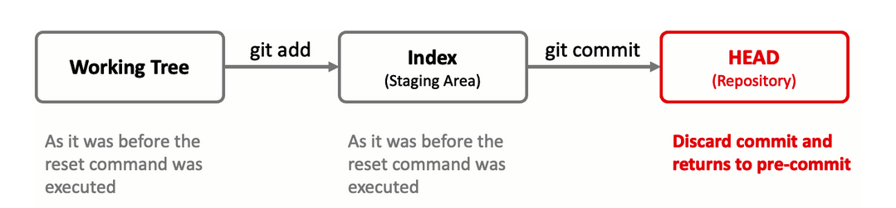

- **Reset mixto:**  
  Esto resetea el índice pero mantiene el directorio de trabajo sin cambios. Este comando se usa cuando quieres deshacer solo lo que `git add` y `git commit`. Los cambios en los archivos permanecerán; esta es la opción predeterminada cuando no se especifican opciones con `git reset`:

  ```bash
  # Reinicia el área de staging, pero conserva los cambios en el directorio de trabajo
  $ git reset --mixed <commit hash>
  ```

  Lo siguiente es el área de impacto del comando `git reset --mixed`:
  
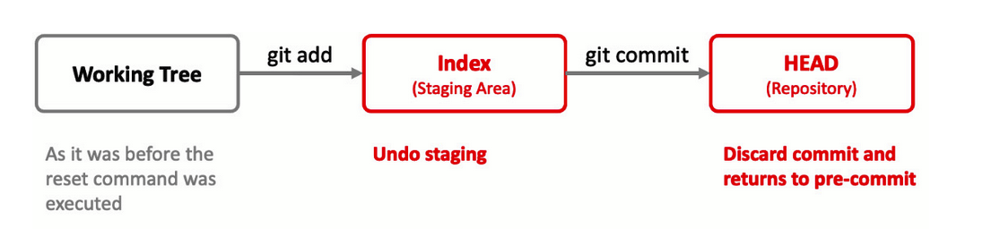

- **Reset duro:**  
  Esto resetea el índice y el directorio de trabajo, eliminando permanentemente los cambios no commiteados. Elimina todos los cambios en los commits, índices y archivos, por lo que todos los cambios en sí no permanecen contigo. Si deseas eliminar todo, esta es la forma de hacerlo:

  ```bash
  # Reinicia tanto HEAD, el área de staging y el directorio de trabajo, descartando todos los cambios
  $ git reset --hard <commit hash>
  ```

  Lo siguiente es el área de impacto del comando `git reset --hard`:
  
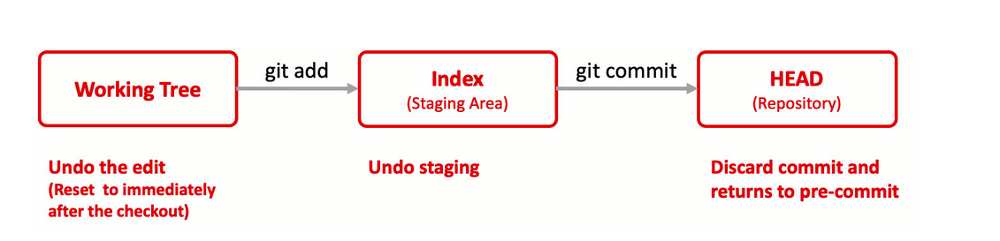

#### `git revert`–Deshacer sin reescribir el historial

A diferencia de `git reset`, que altera el historial de commits, `git revert` crea un nuevo commit que deshace los cambios realizados por un commit anterior. Esto es extremadamente útil en un entorno compartido donde reescribir el historial es altamente desaconsejado.

- **Creación del commit inverso:**  
  `git revert` crea un commit inverso como sigue:
  


  Este comando deshará los cambios realizados por el commit con el hash especificado y creará un nuevo commit para registrar esta acción:

  ```bash
  # Revertir un commit específico sin alterar el historial
  $ git revert <commit_hash>
  ```

#### Casos de uso para `git revert`

- **Ramas compartidas:**   Dado que `git revert` no reescribe el historial, es seguro usarlo en ramas compartidas.

- **Reversión de características:**  Si una característica resulta ser buggy o no deseada, `git revert` es una forma limpia de eliminarla.

- **Despliegues automatizados:**  En un pipe CI/CD, puedes automatizar la operación de `git revert` como parte de tu estrategia de reversión.

#### Opciones avanzadas de `git revert`

- **Revertir múltiples commits:**  Puedes revertir un rango de commits especificando un rango de commits:

  ```bash
  # Revertir un rango de commits (incluyendo el commit más antiguo del rango)
  git revert OLDEST_COMMIT^..NEWEST_COMMIT
  ```

- **Reversión con edición manual:**  Si deseas editar manualmente los cambios antes de commitearlos, puedes usar los flags `-n` o `--no-commit`:

  ```bash
  # Revertir y aplicar los cambios al directorio de trabajo sin commitear
  git revert -n <commit_hash>
  ```

  Esto aplicará los cambios revertidos a tu directorio de trabajo pero no los commiteará. Luego puedes realizar más cambios y commitearlos manualmente.

> **NOTA:**  
> Ten en cuenta el símbolo de caret (`^`). Esto significa que el commit más antiguo en el rango de commits a revertir está incluido.

Dominar `git revert` es crucial para cualquier desarrollador o profesional de DevOps. Proporciona un mecanismo seguro para deshacer cambios, permitiendo una mejor colaboración y un código más confiable.

### `git checkout` – Más que solo cambiar de ramas

En discusiones anteriores, hemos mencionado el comando `git checkout` principalmente en el contexto de cambiar entre ramas. Si bien esta es ciertamente una de sus funciones principales, es crucial entender que `git checkout` es una herramienta multipropósito que también puede operar a la granularidad de archivos individuales o directorios. 

#### Uso básico de `git checkout`

- **Cambiar de ramas:**

  ```bash
  # Cambiar a una rama específica
  $ git checkout <branch_name>
  ```

- **Restaurar un archivo a un estado anterior:**  
  Si has realizado cambios en un archivo pero aún no los has commiteado y decides que quieres deshacer esos cambios, puedes hacerlo:

  ```bash
  # Descartar los cambios en un archivo y restaurarlo al último commit
  $ git checkout -- <file_name>
  ```

- **Aplicar parcialmente cambios de otra rama:**  
  Si necesitas extraer solo un archivo específico de otra rama para mezclarlo a tu rama actual:

  ```bash
  # Extraer un archivo específico de otra rama
  $ git checkout <branch_name> -- <file_name>
  ```

#### Ventajas de usar `git checkout` en la colaboración

- **Reversiones rápidas:**  
  Si algo sale mal en producción, puedes rápidamente revisar los archivos específicos desde una rama estable.

- **Pruebas de características selectivas:**  
  Antes de fusionar una nueva característica, puedes revisar solo los archivos relevantes para esa característica y realizar pruebas.

- **Corrección fácil de errores:**  
  La capacidad de revisar archivos individuales facilita corregir errores sin afectar otras partes de la base de código.

> **NOTA:**  
> Usar `git checkout` en archivos descartará los cambios. Asegúrate de que esto es lo que pretendes hacer. Si estás experimentando, es una buena idea commitear tus cambios a menudo. De esa manera, puedes revertir fácilmente a un commit específico si es necesario.

Entender toda la gama de capacidades de `git checkout` puede mejorar significativamente tu flujo de trabajo y la eficiencia en la colaboración. Ya sea que estés trabajando solo o como parte de un equipo, la capacidad de manipular no solo ramas sino también archivos individuales te otorga un mayor grado de control y adaptabilidad en tu colaboración en equipo.

#### Organizando tu entorno de trabajo

En el ámbito del desarrollo en equipo, tu espacio de trabajo individual es tu laboratorio personal, un espacio donde puedes innovar, depurar y probar libremente sin afectar el proyecto en general. Gestionar este espacio de manera eficiente es crucial, y Git ofrece un conjunto de comandos poderosos para ayudarte a hacerlo. En esta nota, exploraremos tres comandos esenciales de Git: `git clean`, `git stash` y `.gitignore`, que pueden mantener tu espacio de trabajo limpio fácilmente.

#### `git clean` – Un nuevo comienzo

El comando `git clean` ofrece una forma rápida de limpiar tu directorio de trabajo de archivos y directorios no rastreados, proporcionando esencialmente un borrón y cuenta nueva. Esto puede ser especialmente útil antes o después de ejecutar una fusión, o cuando deseas eliminar cualquier desorden que no necesita ser controlado por versiones:

```bash
# Eliminar archivos y directorios no rastreados
$ git clean -fd
```

#### `git stash` – Pausa y reanuda el trabajo sin esfuerzo

`git stash` es una herramienta invaluable para guardar temporalmente los cambios que has realizado pero que aún no estás listo para commitear.

Como desarrollador, multitasking a menudo es el nombre del juego. Ya sea que te interrumpa una corrección urgente de un error o necesites cambiar de contexto temporalmente, `git stash` viene al rescate. Este comando te permite guardar tus cambios actuales sin hacer un commit formal, dándote la libertad de cambiar de tareas y luego volver a donde lo dejaste:

```bash
# Guardar cambios con una descripción
$ git stash save "WIP: New Feature"

# Volver a aplicar los cambios guardados
$ git stash apply stash@{0}
```

Además, aquí tienes un resumen de comandos comunes de `git stash` que pueden mejorar significativamente tu gestión del espacio de trabajo:

- **`git stash`**: Guarda tus cambios, dejando tu directorio de trabajo limpio. Los archivos no rastreados no se guardan.
- **`git stash save "Tus comentarios"`**: Guarda tus cambios y permite adjuntar un comentario. Esto es útil para identificar stashes más tarde con `git stash list`.
- **`git stash list`**: Muestra una lista de todos tus cambios guardados. Si usaste `git stash save`, verás tus comentarios aquí, lo que facilita identificar cada stash.
- **`git stash apply`**: Restaura los cambios guardados más recientemente a tu directorio de trabajo. El stash permanece en la lista de `git stash`.
- **`git stash apply [stash@{n}]`**: Restaura un stash específico basado en su número de índice, que puedes encontrar usando `git stash list`.
- **`git stash drop`**: Elimina un stash específico de la lista de stashes.
- **`git stash drop [stash@{n}]`**: Elimina un stash específico basado en su número de índice.
- **`git stash clear`**: Elimina todos los stashes, limpiando tu lista de stashes.


#### `.gitignore` – Personaliza lo que se comparte

Cuando trabajas en proyectos complejos, tu entorno local puede generar archivos como logs o contener configuraciones personales, cosas que no deseas compartir con el resto del equipo. El archivo `.gitignore` te permite especificar qué archivos y carpetas deben ignorarse durante un `git add`, asegurando que permanezcan exclusivos de tu entorno local.

Este es un ejemplo de un archivo `.gitignore`:

```plaintext
# Ignorar todos los archivos de log
*.log

# Ignorar archivos de configuración personal
config/personal/
```

### Grandes maneras de ayudarte a depurar

Git tiene un par de formas típicas de analizar el pasado. `git blame` y `git bisect` son útiles para recordar quién hizo qué cambios, facilitando la depuración.


#### `git blame` – ¿Quién hizo qué?

Cuando trabajas en una base de código compartida, puede haber ocasiones en las que necesites comprender el historial de líneas de código específicas. El comando `git blame` proporciona un desglose de un archivo, anotando cada línea para mostrar la última persona que la modificó y a qué commit pertenece. Esto ayuda a identificar a los responsables de cambios particulares, lo cual es útil para depurar, refactorizar o simplemente entender por qué existe un código en particular.

```bash
$ git blame file.txt
```

La opción `-L` te permite especificar las líneas de salida:

```bash
$ git blame -L 5,10 README.md
$ git blame -L 5,+5 README.md
```

Es esencial resaltar que el objetivo de `git blame` no es señalar a individuos por errores o decisiones cuestionables. En cualquier entorno colaborativo, especialmente en DevOps donde el trabajo en equipo es primordial, es crucial recordar que los errores son una responsabilidad colectiva. Todos pueden cometer errores; lo que importa es cómo el equipo colabora para corregir esos errores. Desde una perspectiva de seguridad psicosocial, usar `git blame` debe enfocarse como una manera de mejorar la comunicación del equipo e identificar áreas de mejora en lugar de como un mecanismo para culpar.

#### `git bisect` – Caza de errores eficiente en rangos de commits

Depurar puede sentirse a menudo como buscar una aguja en un pajar, especialmente en bases de código grandes con un historial largo de commits. En el ámbito de DevOps, donde los ciclos de despliegue rápido son la norma, un error introducido en cualquiera de los numerosos cambios puede causar estragos. Aquí es donde entra en juego `git bisect`, sirviendo como una herramienta poderosa para aislar el commit específico que introdujo un error.

El comando `git bisect` realiza una **búsqueda binaria** a través de tu historial de commits para encontrar el commit que introdujo el error. El proceso comienza marcando un commit conocido como bueno y un commit conocido como malo:

```bash
$ git bisect start
$ git bisect bad   # Si la versión actual es mala
$ git bisect good <Último commit conocido como bueno>
```

Git luego comprobará automáticamente un commit a mitad de camino entre los commits buenos y malos. Pruebas este commit y luego lo marcas como bueno o malo:

```bash
$ git bisect good # o
$ git bisect bad
```

Git continuará este proceso, reduciendo el rango de commits hasta que identifique al culpable. Una vez que encuentres el commit problemático, es más fácil entender qué salió mal y diseñar una solución:

```bash
# Salir del modo bisect y volver a tu rama
$ git bisect reset
```

En DevOps, donde la velocidad para identificar y resolver problemas es crucial para mantener la excelencia operativa, `git bisect` se convierte en una herramienta invaluable. Se integra bien en una cadena de herramientas DevOps, permitiendo pruebas automatizadas y facilitando reversiones y parches más rápidos. Al identificar errores de manera eficiente, mejora la capacidad del equipo para colaborar en soluciones, subrayando los principios esenciales de DevOps de retroalimentación rápida y mejora continua.

### Excelencia en la versioning

En el ecosistema de DevOps, CI/CD hace que todo sea incremental. Sin embargo, es esencial tener versiones concretas de tu software que sirvan como hitos. Estas versiones no son solo marcadores en el tiempo; indican la estabilidad, las nuevas características y el estado general de tu base de código. También facilitan reversiones más suaves y hacen que sea más fácil aislar problemas.

#### ¿Qué es la versioning semántica?

La versioning semántica es un esquema de versioning diseñado para transmitir significados específicos sobre los cambios subyacentes con cada nueva versión. El formato consta de tres números separados por puntos (por ejemplo, 2.4.4). Cada número tiene un significado particular relacionado con la compatibilidad hacia atrás y los tipos de cambios introducidos.

#### Tagging en Git

El tagging se convierte en una piedra angular del control de versiones efectivo dentro de un entorno DevOps. Al marcar puntos específicos en la historia de tu repositorio, puedes crear anclas que sirvan como puntos de lanzamiento estables o hitos significativos.

Estas versiones etiquetadas forman la base de tus pipelines de CI/CD, asegurando despliegues consistentes y confiables. Para hacer que tus tags sean más informativos, considera anotarlos con metadatos y contexto útiles:

```bash
$ git tag -a v1.0 -m "Initial stable release"
```

Los commits que etiquetes deben representar típicamente puntos de lanzamiento estables o hitos cruciales. Estos son los commits donde todas las pruebas automatizadas han pasado, las características están completas y el código ha pasado por revisión de pares. En esencia, son tus commits listos para producción.

Para etiquetar un commit específico, usa lo siguiente:

```bash
$ git tag v2.4.4 32de0b2
```

El tagging de Git y la versioning semántica no son solo procedimientos técnicos, sino acciones estratégicas. Aseguran que todos estén en la misma página con respecto a lo que se está desplegando y lo que puede hacer.
