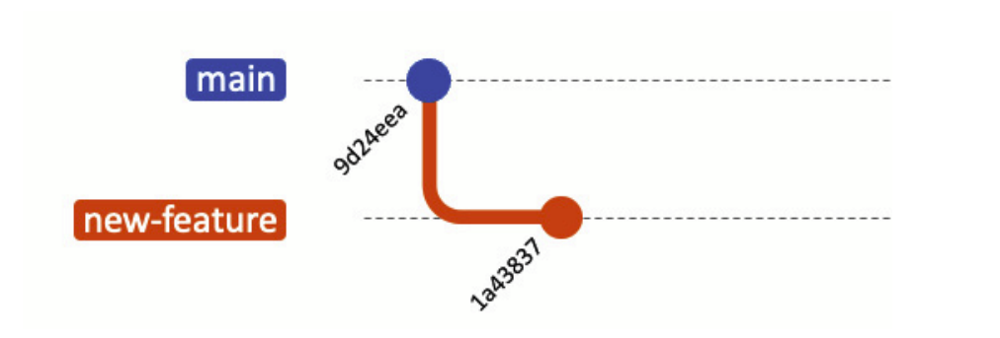

### `git rebase` – Reescribiendo para mayor claridad

Rebasing es otra técnica poderosa en Git que difiere significativamente de merging. La principal diferencia entre merging y rebasing es cómo integran los cambios. Mientras que `git merge` integra los cambios de una rama en otra, `git rebase` mueve o combina una secuencia de commits a un nuevo commit base.

En el contexto de la colaboración en equipo, el rebasing se utiliza para mantener un historial de proyecto lineal, lo que simplifica la depuración y facilita las revisiones de código. Sin embargo, el rebase viene con su parte de complejidades y trampas, y generalmente es mejor usarlo en circunstancias específicas.

Antes de sumergirnos en el tutorial práctico, entendamos cómo funciona `git rebase` a un alto nivel. La utilidad principal del rebasing es colocar los cambios de la feature branch en la parte superior de otra rama.

Por ejemplo, considera las siguientes ramas:


Después de hacer rebase de la feature branch sobre main, tu rama podría verse así:


Finalmente, puedes fusionarte de nuevo a main, en cuyo caso se puede realizar una fusión fast-forward:


#### Pasos prácticos para `git rebase`

Tomemos un ejemplo práctico con una rama **main** y una **new-feature branch**. Aquí te mostramos cómo realizar rebase:

```bash
# Inicializar un nuevo repositorio
$ mkdir prueba-git-rebase
$ cd prueba-git-rebase
$ git init

# Agregar y commitear README.md inicial a main
$ echo "# Mi projecto rebase " > README.md
$ git add README.md
$ git commit -m "Commit inicial en el main"

# Crear y cambiar a una nueva rama 'new-feature'
$ git checkout -b new-feature

# Hacer algunos cambios, agregarlos y commitearlos
$ echo "Esta es una nueva caracteristica" >> NewFeature.md
$ git add NewFeature.md
$ git commit -m "Se agrega una nueva caracteristica"
```

En este punto, tu historial de ramas puede verse algo así:



Ahora, digamos que se han agregado nuevos commits a **main** mientras trabajabas en **new-feature**:

```bash
# Cambiar de nuevo a 'main' y agregar nuevos commits
$ git checkout main
$ echo "Actualiza el proyecto" >> Updates.md
$ git add Updates.md
$ git commit -m "Se actualiza main"
```

Tu gráfico de commits ahora diverge:


Ahora, haz rebase de **new-feature** sobre **main**:

```bash
# Cambiar a 'new-feature' y hacer rebase sobre main
$ git checkout new-feature
$ git rebase main
```

Veamos cómo se ve ahora:

```bash
$ git log --graph --oneline
* 43ea59e (HEAD -> new-feature) Esta es una nueva caracteristica
* 16e1878 (main) Se actualiza main
* 3021494 Initial Commit inicial en el main
```

Después de esto, tus ramas se verán como sigue:


Ahora es el momento de fusionar y completar el proceso de `git rebase`:

```bash
# Cambiar a 'main' y realizar una fusión fast-forward
$ git checkout main
$ git merge new-feature
```

Cuando se realiza una fusión fast-forward, las HEADs de las ramas **main** y **new-feature** serán los commits correspondientes, como se muestra:


#### ¿Por qué el rebasing es poderoso en DevOps y colaboración en equipo?

La principal ventaja del rebasing en una cultura DevOps es que resulta en un historial de proyecto mucho más limpio que el merging. Los historiales más limpios son más fáciles de depurar, más simples de entender y tienen más sentido lógico para los desarrolladores que se unen al proyecto en una fecha posterior.

Aquí tienes algunos beneficios:

- **Historial lineal:** Es más fácil de entender que el historial no lineal creado por `git merge`.
- **Depuración simplificada:** Con un historial más limpio, rastrear cuándo se introdujo un error en particular se vuelve más fácil.
- **Higiene del código:** El rebasing te anima a aplastar commits de corrección o dividir commits más grandes, haciendo que tus cambios sean más comprensibles en comparación con los otros desarrolladores.

#### Las precauciones y trampas del `git rebase`

Hay reglas de oro a seguir: no hagas rebase en ramas públicas (de equipo). Una de esas reglas cardinales es evitar hacer rebase en ramas públicas. El rebase puede ser una gran herramienta para limpiar una feature branch, pero cuando se realiza en ramas que están disponibles públicamente, puede convertirse en un desastre.

Aquí están las cosas a considerar cuando uses `git rebase`:

- **Conflictos para los colaboradores:** Imagina que has hecho rebase en una rama pública y has enviado los cambios. Otros desarrolladores que ya han descargado la versión antigua de la rama ahora tienen un historial divergente. Cuando intenten enviar sus cambios, Git rechazará el push, obligándolos a reconciliar los historiales. Esto crea trabajo extra y aumenta la probabilidad de conflictos de merge.
- **Fusiones complejas:** Después de que una rama pública ha sido rebased y se ha alterado el historial, fusionarla con otras ramas puede convertirse en un verdadero desafío. Debido a que Git usa el historial de commits para determinar cómo integrar cambios, modificar ese historial puede hacer que la fusión sea mucho más complicada de lo necesario.
- **Pérdida de contexto:** El rebase puede aplastar commits juntos o cambiar su orden, lo que puede resultar en una pérdida de contexto para esos cambios. Esto hace que la depuración sea más difícil y puede complicar la tarea de entender el proceso de desarrollo que llevó a la base de código actual.

El rebasing puede ser complejo y arriesgado, especialmente para desarrolladores inexpertos. En los peores escenarios, podrías tener que resolver muchos conflictos, lo que lleva a errores y bugs si no se hace con cuidado.

Al comprender y utilizar `git merge` y `git rebase`, puedes manejar prácticamente cualquier situación que requiera combinar diferentes líneas de desarrollo. Cada uno tiene su lugar en un comando de Git, y entender cuándo usar cada uno es la clave para mantener una base de código limpia y comprensible, algo que es altamente valioso en el mundo de DevOps.


### `git cherry-pick`- Selección de commits específicos

Una de las herramientas más flexibles en los comandos de Git es el comando `git cherry-pick`. Mientras que los métodos de merge anteriores se usaban principalmente para integrar ramas enteras, `git cherry-pick` te permite seleccionar commits específicos de una rama y aplicarlos a otra rama. Este método puede ser increíblemente útil cuando necesitas aplicar solo algunos cambios específicos sin tomar todas las modificaciones de una rama diferente.

Imagina que tienes dos ramas, **main** y **feature**. Te das cuenta de que uno o dos commits de la rama **feature** deberían moverse a **main**, pero no estás listo para fusionar toda la rama. El comando `git cherry-pick` te permite hacer precisamente eso:


Puedes cherry-pick los cambios de un commit específico en la rama **feature** y aplicarlos a **main**. Esta acción creará un nuevo commit en la rama **main**:


#### Pasos prácticos para cherry-picking

Ahora repasemos los pasos prácticos para cherry-picking de cambios y fusionarlos en una rama. Cada commit agrega un archivo a cada uno de ellos. Tomemos algunos de esos commits y fusionémoslos en **main**. Primero, agregamos los archivos:

```bash
# Inicializar un nuevo repositorio
$ mkdir prueba-cherry-pick
$ cd prueba-cherry-pick
$ git init

# Agregar y commitear README.md inicial a main
$ echo "# Mi Projecto" > README.md
$ git add README.md
$ git commit -m "Commit inicial"

# Crear y cambiar a una nueva rama 'add-base-documents'
$ git checkout -b add-base-documents

# Hacer cambios y commitearlos
# Agregar CONTRIBUTING.md
$ echo "# CONTRIBUTING" >> CONTRIBUTING.md
$ git add CONTRIBUTING.md
$ git commit -m "Add CONTRIBUTING.md"

# Agregar LICENSE.txt
$ echo "LICENSE" >> LICENSE.txt
$ git add LICENSE.txt
$ git commit -m "Add LICENSE.txt"

# Echa un vistazo al log de la rama 'add-base-documents'
$ git log add-base-documents --graph --oneline
* 02ee2b4 (HEAD -> add-base-documents) Add LICENSE.txt
* a80e8ad Add CONTRIBUTING.md
* cfb060a (main) Commit inicial
```

Ahora, las ramas se ven como las del siguiente diagrama:


Ahora, solo elijamos el commit `a80e8ad` y pongámoslo en la rama **main**. Reemplaza el valor del hash en tu entorno:

```bash
# Ahora cambia de nuevo a la rama 'main' y cherry-pick el commit
$ git checkout main
$ git cherry-pick a80e8ad
[main 9a36741] Add CONTRIBUTING.md
Date: Sun Oct 29 16:04:56 2023 +0900
1 file changed, 1 insertion(+)
create mode 100644 CONTRIBUTING.md

# Veamos el log de la rama 'main'
$ git log --graph --oneline
* 9a36741 (HEAD -> main) Add CONTRIBUTING.md
* cfb060a Commit inicial
```

Después de que hayas realizado con éxito el cherry-pick del commit, se agregará un nuevo commit a tu rama actual (**main** en este ejemplo) y contendrá los cambios del commit cherry-picked. Ten en cuenta que el nuevo commit tiene los mismos cambios pero un valor de hash de commit diferente:


#### ¿Por qué es útil `git cherry-pick` en DevOps y colaboración en equipo?

El desarrollo en equipo requiere un desarrollo flexible. `git cherry-pick` es un comando útil en entornos de codificación colaborativa, que permite a los equipos integrar cambios selectivamente y mantener la integridad del código.

Veamos qué valor puede ofrecer el cherry-picking:

- **Integración selectiva:** Permite mover correcciones de errores específicas o características en producción sin tener que mover todos los cambios de una rama de desarrollo.
- **Reversión fácil:** Si algo sale mal, solo necesitas revertir un pequeño cambio en lugar de una fusión de rama completa.
- **Historial limpio:** Mantiene tu historial de Git ordenado al incluir solo commits relevantes, lo que facilita su lectura y comprensión.

`git cherry-pick` ofrece un alto nivel de precisión para integrar cambios entre ramas. Te permite seleccionar exactamente qué commits incluir, proporcionando un control granular sobre tu historial de proyecto. Esto lo convierte en una herramienta invaluable para cualquier ingeniero DevOps que busque un flujo de trabajo de control de versiones flexible y eficiente.

---
