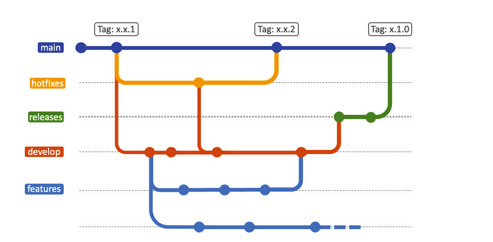
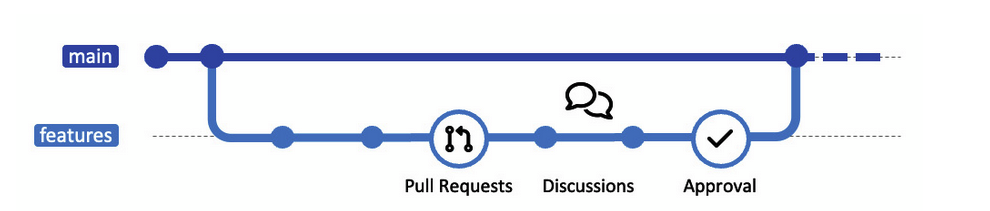
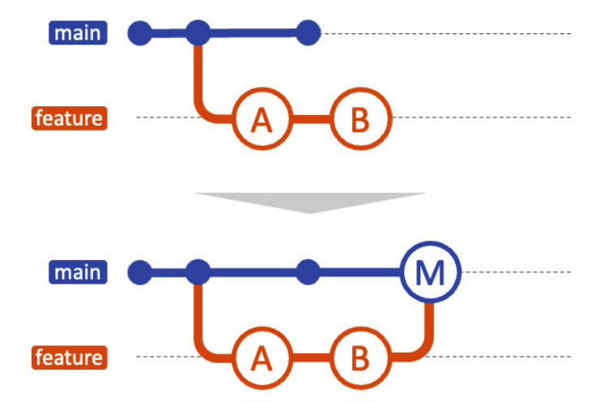
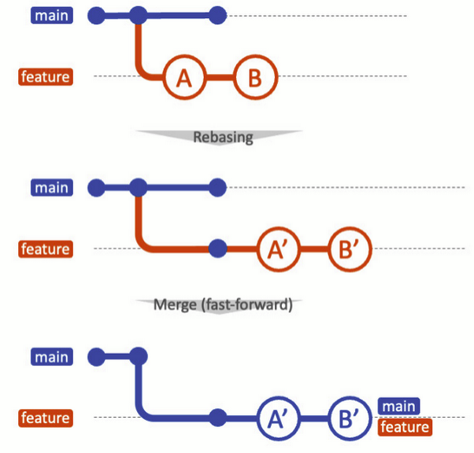
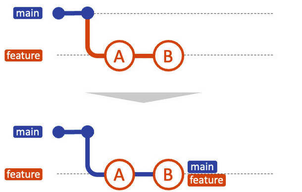
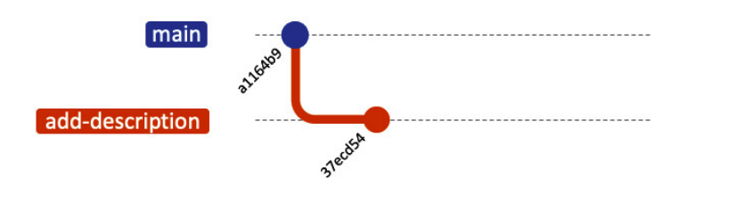
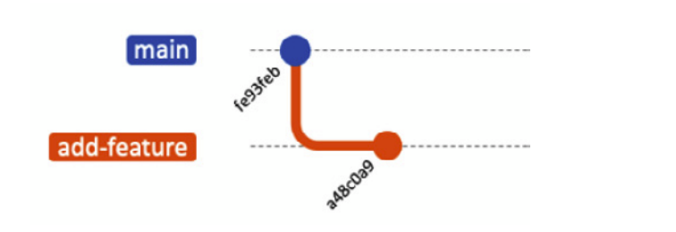
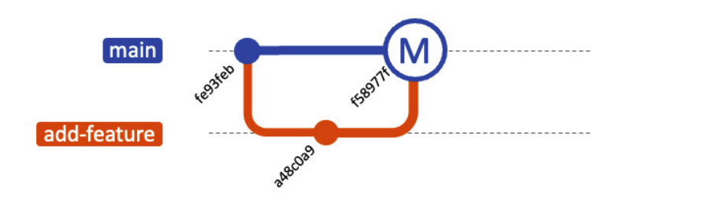

## Uso avanzado de Git para la colaboración en equipo

En esta lectura profundizaremos en varias prácticas que querrás adoptar para mejorar la colaboración en equipo.  Aprenderás a organizar tu historial de commits, gestionar 
ramas complejas y resolver conflictos durante los merges.  El objetivo es que tengas un control total sobre el flujo de ramas y la colaboración en equipo.

Aquí, el enfoque no es solo hacer el trabajo, sino hacerlo de manera que se potencie el trabajo colaborativo. Antes de sumergirnos en los comandos de Git, es crucial 
comprender la estrategia subyacente: las estrategias de ramificación.


### Estrategias de ramificación para la colaboración en equipo

En el ámbito colaborativo, los commits actúan como bloques de construcción esenciales. Estos commits se enlazan para formar un historial cronológico, un registro de la 
evolución de tu proyecto, que se organiza y mantiene a través de ramas.

¿Cómo pueden los ingenieros y los equipos tejer esta historia en una narrativa cohesiva y significativa? La **estrategia de ramificación** es la respuesta: 
se trata de gestionar eficazmente las ramas en Git para permitir una colaboración fluida y una entrega de servicios eficiente.

#### Por qué es importante una estrategia de ramificación

Una estrategia de ramificación es un plan integral que describe cómo se gestionan, crean e integran las ramas dentro de tu flujo de trabajo de desarrollo. 
Va más allá de los aspectos técnicos del manejo de ramas, ya que también involucra variables contextuales como el tamaño de tu organización, la cultura de tu equipo y los
requisitos específicos de tu proyecto o producto.

Las **políticas de ramificación** son conjuntos de reglas o directrices específicas para la gestión de ramas. A menudo, estas políticas forman la columna vertebral de una 
estrategia de ramificación y sirven como plantillas que se personalizan según las necesidades particulares.
Por ejemplo, políticas como Git Flow o GitHub Flow, que veremos en esta clase, se utilizan para definir la manera de trabajar en equipo. 
Martin Fowler, reconocido líder en pensamiento de software, aborda estos temas en la sección "Looking at some branching policies" de 
su artículo [Patterns for Managing Source Code Branches](https://martinfowler.com/articles/branching-patterns.html). Puedes ver una versión traducida en las lecturas 7 y 8 de 
este repositorio.

Por ello, al definir tu enfoque de ramificación, es crucial elegir una política que sirva de base y personalizarla para alinear los procesos de desarrollo con las 
necesidades y objetivos únicos de tu organización, reduciendo la fricción y acelerando los lanzamientos de software.

#### Cambios pequeños y frecuentes versus cambios grandes y menos frecuentes

Existen muchas políticas de ramificación. Las empresas a menudo acuñan nombres específicos —como GitHub Flow— y las presentan como mejores prácticas. 
Fundamentalmente, todas las estrategias se basan en uno de dos principios: realizar cambios pequeños con frecuencia o efectuar cambios grandes de manera ocasional.

- Para equipos pequeños, la fricción en la integración y el lanzamiento rápido de versiones es menor.
- En organizaciones más grandes, con productos complejos o procesos de aprobación extensos, la fricción aumenta, surgiendo más conflictos y requiriendo controles adicionales.

Permitir que estos desafíos ralenticen el proceso de desarrollo puede afectar negativamente el lanzamiento de productos o proyectos, impactando el éxito empresarial.

Con el tiempo, diversas empresas han ideado estrategias de ramificación para mitigar estos problemas, generalmente basadas en prácticas existentes y adaptadas a las
limitaciones de cada organización, con el objetivo de lograr lanzamientos más rápidos. Es fundamental entender que ninguna estrategia es una solución única para todos; la 
estrategia base se selecciona según la composición y cultura del equipo y se personaliza a partir de ahí.

Esta sección presenta tres políticas de ramificación comunes:

- **Desarrollo basado en troncales**
- **Git Flow**
- **GitHub Flow**

Cada una se mapea en función de la frecuencia con que tu equipo necesita lanzar versiones y del tamaño y complejidad de tu proyecto.

#### Desarrollo basado en troncales

El **desarrollo basado en troncales** (TBD, por sus siglas en inglés) es un enfoque en el que los desarrolladores trabajan en ramas de corta duración —típicamente menos de un 
día— o directamente desde una única rama llamada troncal o línea principal. El principio clave es minimizar la vida útil de las ramas para promover integraciones frecuentes y 
evitar los problemas asociados a ramas de larga duración, como conflictos de merge y divergencias en la base de código.

En TBD, el troncal siempre debe estar en condiciones de trabajo y en un estado desplegable. Los desarrolladores trabajan en pequeñas partes de una característica o tarea y
las fusionan en el troncal lo antes posible. Si una funcionalidad aún no está lista para producción, se pueden usar flags de características para ocultarla hasta que esté 
completa, permitiendo que el código se integre sin afectar a los usuarios finales.

Como se ilustra en la figura, en TBD se crean muchas ramas de corta duración que se fusionan en la línea principal.


Dado que la integración ocurre con frecuencia, es crucial contar con un conjunto robusto de pruebas automatizadas que se ejecuten cada vez que se fusiona código en el troncal, 
asegurando así que la base de código se mantenga estable y desplegable. Las herramientas de integración continua (CI) se utilizan comúnmente en conjunto con TBD para 
automatizar las pruebas y el proceso de construcción, garantizando que el troncal siempre esté en buen estado.

Para acomodar hotfixes (correcciones urgentes), los desarrolladores pueden crear ramas de corta duración que se fusionan de inmediato en el troncal una vez completadas, lo que 
permite abordar rápidamente problemas críticos sin comprometer la estabilidad.

**Pros:**
- **Integración frecuente:** Al fusionar el código con regularidad, los conflictos son menos probables y más fáciles de resolver.
- **Ciclo de retroalimentación rápido:** La integración continua ayuda a identificar problemas de forma temprana.
- **Flujo de trabajo simplificado:** Sin la proliferación de ramas de larga duración, el flujo de trabajo se simplifica y es más fácil de gestionar.

**Contras:**
- **Riesgo de inestabilidad:** Si las pruebas no son exhaustivas, las fusiones frecuentes pueden introducir código inestable en la línea principal.
- **Limitado para características grandes:** Para cambios muy grandes o disruptivos, este enfoque puede desestabilizar la línea principal durante un período prolongado.

#### Git flow

**Git flow** es una política de ramificación orientada a proyectos robustos y es especialmente adecuada para aquellos que tienen un ciclo de lanzamiento programado. 
Este enfoque estructurado involucra varios tipos de ramas: *feature*, *release*, *develop* y *hotfix*, junto con la rama *main* (o *master*).



En Git flow:

- El desarrollo comienza ramificando una rama **develop** a partir de **main**.
- La rama **develop** sirve como integración para las características, donde se fusionan todas las ramas de los desarrolladores.
- Al iniciar una nueva característica o corregir un bug, se crea una **feature branch** desde **develop**.
- Una vez que la característica está completa y probada, se fusiona de nuevo en **develop**.
- Para preparar un lanzamiento, se crea una **release branch** desde **develop**. En esta rama se realizan las correcciones finales o actualizaciones de documentación.
- Cuando la release está lista, se fusiona en **main** y se etiqueta con un número de versión, además de fusionarse de nuevo en **develop** para incorporar los cambios futuros.
- Para correcciones urgentes, se puede crear una **hotfix branch** directamente desde **main**.

Git flow proporciona una estructura que favorece la separación de procesos de desarrollo, lo que facilita una historia del proyecto más legible y reversible.

**Pros:**
- **Flujo de trabajo estructurado:** Es ideal para proyectos con ciclos de lanzamiento definidos.
- **Aislamiento:** Las feature branches permiten trabajar en aislamiento, facilitando la gestión de características complejas.
- **Soporte para hotfixes:** Las ramas dedicadas a hotfix facilitan la corrección rápida de errores en producción.

**Contras:**
- **Complejidad:** Para equipos o proyectos pequeños, Git Flow puede introducir una complejidad innecesaria.
- **Integración retrasada:** Las feature branches de larga duración pueden ocasionar conflictos de merge o la detección tardía de errores.


#### GitHub flow

**GitHub flow** es un flujo de trabajo simplificado que fomenta la entrega continua. Se basa en una única línea principal y en feature branches de corta duración. 
Su principio es: ramificar, desarrollar una nueva característica, enviar un pull request y revisar el código antes de desplegar. 
El pull request, una funcionalidad propia de GitHub, permite notificar al equipo que se ha completado una tarea, la cual se revisa y discute antes de fusionarse en la 
rama principal.



El proceso típico en GitHub flow es el siguiente:

1. Crear una nueva rama descriptiva a partir de la rama predeterminada del repositorio, que actúa como entorno seguro para realizar cambios sin afectar la base de código principal.
2. Realizar commits y enviar la rama al repositorio remoto.
3. Crear un pull request detallado para revisión, vinculado a issues relacionados para proporcionar contexto.
4. Incorporar comentarios y sugerencias mediante nuevos commits en el pull request.
5. Una vez aprobado, fusionar el pull request en la rama predeterminada, integrando los cambios en la base de código principal.
6. Eliminar la rama de trabajo, manteniendo el historial de commits y discusiones para referencia futura.

**Pros:**
- **Simplicidad:** Ofrece un enfoque sencillo con una única línea principal y feature branches de corta duración, facilitando la gestión incluso para principiantes.
- **Despliegue más rápido:** Fomenta la integración y entrega continua, permitiendo lanzamientos frecuentes y acelerando la retroalimentación.
- **Colaboración mejorada:** El mecanismo de pull request promueve revisiones de código transparentes y la colaboración, asegurando calidad y propiedad colectiva del proyecto.

**Contras:**
- **Compatibilidad con plataformas:** GitHub flow está optimizado para GitHub; al integrarse con otras plataformas puede requerir herramientas adicionales o ajustes.
- **Adaptabilidad en proyectos complejos:** Para equipos grandes o proyectos multifacéticos, la simplicidad de GitHub Flow puede limitar el control granular sobre desarrollos
   simultáneos, requiriendo estrategias adicionales para la coordinación de lanzamientos.


#### Directrices y ejemplos para el nombramiento de ramas

Las siguientes son las principales directrices y ejemplos para nombrar ramas. Ten en cuenta que estos son solo ejemplos y que cada equipo puede tener convenciones de 
nombres muy diferentes.

##### **Orientaciones generales:**

- **Usa guiones, guiones bajos o barras:**  
  Utilizar espacios en los nombres de las ramas puede generar errores y complicaciones al interactuar con la línea de comandos de Git. En su lugar, emplea guiones (-), guiones bajos (_) o barras (/) para separar palabras. Las barras se usan especialmente como separadores en temas como hotfixes y features.

- **Nombres en minúsculas:**  
  Aunque Git distingue entre mayúsculas y minúsculas, usar solo minúsculas ayuda a mantener la consistencia y a evitar confusiones.

- **Hazlo descriptivo pero breve:**  
  El nombre debe ofrecer una idea instantánea de lo que trata la rama sin ser excesivamente largo.

##### **Ejemplos de nombres para cada tipo de rama:**

- **Feature branches:**  
  Se utilizan para desarrollar nuevas funcionalidades. Los nombres deben comenzar con `feature/`, seguido de una breve descripción.  
  *Ejemplo:* `feature/user-authentication`.

- **Bugfix branches:**  
  Destinadas a corregir errores, deben comenzar con `bugfix/` y luego incluir un descriptor corto.  
  *Ejemplo:* `bugfix/login-error`.

- **Hotfix branches:**  
  Utilizadas para correcciones urgentes que deben desplegarse a producción lo antes posible, inician con `hotfix/`.  
  *Ejemplo:* `hotfix/xyz-security-vulnerability`.

- **Release branches:**  
  Para ramas en preparación de un lanzamiento, se usa el prefijo `release/`.  
  *Ejemplo:* `release/v1.2`.

##### **Nombres contextuales**

Si bien estas categorías son un buen punto de partida, también puedes agregar información contextual al nombre de la rama. 
Por ejemplo, podrías incluir el número del issue al final (e.g., `feature/123-user-authentication`) o el nombre de la persona responsable (e.g., `feature/teamxyz-authentication`).

En esta sección se reconoce que una estrategia de ramificación sólida es la columna vertebral de cualquier proyecto de desarrollo colaborativo. 

##### **Maneras de aplicar tus cambios en una rama**

Ahora que has profundizado en las complejidades de la gestión de ramas y los flujos de trabajo en DevOps, es probable que ya veas el panorama general. 
Has comprendido cómo tus commits individuales contribuyen al flujo global de desarrollo. 
El siguiente paso es conectar los puntos: considerar cómo el código que has escrito se fusiona en la línea principal.

La base de código es un entorno vivo y colaborativo, que recoge el historial de contribuciones de varios miembros del equipo. 
En un entorno de ritmo acelerado, puede resultar tentador realizar commits apresurados o enviar grandes porciones de cambios de una sola vez para cumplir con los plazos. 
Sin embargo, al fusionar, es crucial evaluar cómo tus cambios contribuyen a mantener un entorno compartido que sea consistente, comprensible y estable. 
Esta consideración es especialmente vital en una cultura DevOps, donde el objetivo no es solo un despliegue rápido, sino también una colaboración sin fricciones.

---
### Merging  y rebasing

Git ofrece dos técnicas principales para integrar cambios: **merging** y **rebasing**. Aunque ambos cumplen el mismo propósito final –juntar diferentes líneas de código–, 
tienen matices operativos distintos. Antes de sumergirnos en varios comandos reales, distingamos entre ambos métodos.

#### Merging

El **merging** toma el contenido de una rama fuente y lo integra en una rama objetivo. Este nuevo commit tendrá dos commits padres, preservando los historiales 
independientes de las ramas que se fusionan. Aunque el merging puede resultar complejo al mantener el historial tal como está, es muy útil por la flexibilidad que 
ofrece cuando varias personas trabajan simultáneamente en un proyecto.

Principalmente, existen dos formas de realizar un merge:

- **Non-fast-forward merge:** Crea un nuevo commit de merge para registrar la fusión.
- **Fast-forward merge:** No crea un commit de merge, sino que mueve la referencia de la rama objetivo al último commit de la rama fuente.

Además, está la opción **squash**, que comprime varios commits en uno solo para la fusión.

En plataformas como GitHub, la configuración predeterminada suele realizar commits de merge, como se muestra en la siguiente figura:



**Pros del merging:**
- **Preservación del historial:** Conserva el historial de ambas ramas, ofreciendo un registro detallado.
- **Sencillez:** Es generalmente más fácil de entender para principiantes.
- **Aislamiento de ramas:** Permite que las ramas individuales continúen haciendo cambios de forma independiente.

**Contras del merging:**
- **Historial complejo:** Puede generar un registro de commits complicado y desordenado.
- **Falta de linealidad:** El historial del proyecto se vuelve no lineal, lo que dificulta su seguimiento.


#### Rebasing

El **rebasing** es el proceso de mover o combinar una secuencia de commits sobre una nueva base. Esencialmente, toma los cambios realizados en una rama de características (feature branch) y los reproduce sobre la parte superior de otra rama. En lugar de crear un nuevo commit, el rebasing reescribe el historial para producir una secuencia lineal.
 Al mirar hacia atrás en el tiempo, es fácil seguir el flujo de lo que sucedió en la rama principal, lo cual es muy bueno en términos de corrección de errores. 
 


Una de sus grandes ventajas es la linealidad del historial, lo que facilita el rastreo de cambios y la corrección de errores.

**Pros del rebasing:**
- **Historial más limpio:** Resulta en un historial de proyecto mucho más limpio y lineal.
- **Elimina el ruido:** Suprime commits de merge innecesarios.
- **Depuración sencilla:** Con un historial lineal, resulta más fácil identificar y solucionar problemas.

**Contras del rebasing:**
- **Riesgo en ramas compartidas:** Puede ser destructivo en ramas compartidas, ya que reescribe el historial.
- **Complejidad:** Es más complicado de entender y ejecutar correctamente.

Ambas técnicas tienen ventajas y desventajas. Mientras que el merging conserva el historial original pero puede complicarlo, el rebasing ofrece un historial limpio con ciertos riesgos en entornos colaborativos.


### Explorando diferentes formas de fusionar en Git

Ahora profundicemos en los pasos prácticos para fusionar dos ramas, lo que te ayudará a comprender mejor cada método.

#### git merge --ff

Esta sección se centra en el comportamiento de Git conocido como **fast-forward** (–ff). Verás cómo funciona este método y cuándo es adecuado usarlo.

La fusión fast-forward es una de las formas más simples de integrar ramas en Git, ya que **mueve la referencia de la rama objetivo al último commit de la rama fuente**. Al revisar el historial, parecerá que no se ha realizado ningún cambio, lo cual es precisamente el beneficio de esta técnica. En Git, una fusión fast-forward es posible cuando no hay nuevos commits en la rama base después de que se creó la rama de características, eliminando la necesidad de un commit adicional para la unión.



#### Pasos prácticos para la fusión fast-forward

Supongamos que tienes una rama `main` y una rama `add-description`. La rama `add-description` se ha derivado de `main` y planeas fusionar la característica de nuevo en `main`.

```bash
# Inicializar un nuevo repositorio
$ mkdir prueba-fast-forward-merge
$ cd prueba-fast-forward-merge
$ git init

# Agregar y commitear README.md inicial en main
$ echo "# Un proyecto" > README.md
$ git add README.md
$ git commit -m "Commit inicial en main"

# Crear y cambiar a una nueva rama 'add-description'
$ git checkout -b add-description

# Hacer cambios para agregar una descripción, agregar y commitear los cambios
$ echo "Este proyecto es un ejemplo de cómo usar Git." >> README.md
$ git add README.md
$ git commit -m "Agregar descripción del proyecto en README.md"
```

En este punto, la estructura de tu repositorio se parecería al siguiente diagrama (git merge --ff(1)):



Ahora, fusiona estas ramas cambiando de nuevo a la rama `main`:

```bash
# Cambiar de nuevo a 'main' y realizar una fusión fast-forward
$ git checkout main
$ git merge add-description

# Ver el historial lineal
$ git log --graph --oneline

* 26d90bf (HEAD -> main, add-description) Agregar descripción del proyecto en README.md
* 37ecd54 Agregar descripción del proyecto en README.md
* a1164b9 Commit inicial en main
```

Con este proceso, el historial de tu repositorio quedará limpio y lineal (git merge --ff(2)):


#### Por qué las fusiones fast-forward son preferidas en DevOps y colaboración en equipo

Detrás de escena, una fusión fast-forward simplemente mueve **HEAD** (el puntero) al último commit, sin crear un nuevo commit de merge. Esto mantiene el historial de Git limpio y lineal, lo que lo convierte en una operación simple y eficiente.

Las fusiones fast-forward son preferidas en entornos colaborativos por varias razones:
- **Simplicidad:** Mantienen un historial lineal, facilitando su seguimiento.
- **Transparencia:** Permiten rastrear cambios, depurar problemas y comprender la secuencia de integraciones de forma directa.
- **Eficiencia:** Al eliminar la necesidad de un commit de fusión adicional, simplifican las revisiones de código.

No obstante, ten en cuenta que las fusiones fast-forward no siempre son posibles. Este método es adecuado cuando se trabaja en solitario o en desarrollos simples. En proyectos con cambios simultáneos en múltiples ramas, puede ser necesaria una fusión non-fast-forward (o fusión de tres vías).

#### git merge --no-ff – Preservar el historial de ramas

Las fusiones non‑fast‑forward, comúnmente invocadas con el flag `--no-ff`, ofrecen una estrategia de fusión alternativa que difiere de las fusiones fast‑forward 
que discutimos anteriormente. A diferencia de estas últimas, que mueven el puntero de la rama objetivo al último commit de la rama fuente, las fusiones non‑fast‑forward generan un nuevo commit de fusión. Este commit tiene dos padres: uno correspondiente a la rama fuente y otro a la rama objetivo.

Estas fusiones permiten incrustar contexto en el commit de fusión, de modo que, al revisar el historial, sea posible identificar cuándo y por qué se realizó la integración.


#### Pasos prácticos para la fusión non‑fast‑forward

Supongamos que estás trabajando con una rama `main` y una rama `add-feature`. Los pasos para realizar una fusión non‑fast‑forward son los siguientes:

```bash
# Inicializar un nuevo repositorio
$ mkdir prueba-no-fast-forward-merge
$ cd prueba-no-fast-forward-merge
$ git init

# Agregar y commitear README.md inicial en main
$ echo "# Un projecto" > README.md
$ git add README.md
$ git commit -m "Commit inicial en main"

# Crear y cambiar a una nueva rama 'add-feature'
$ git checkout -b add-feature

# Realizar cambios, agregarlos y commitearlos
$ echo "Agregando una nueva funcionalidad..." >> README.md
$ git add README.md
$ git commit -m "Implementar una nueva funcionalidad"
```
Ahora, el log de commits es como se muestra en la figura. Lo que hiciste hasta ahora es lo mismo que hiciste en la sección de git merge --ff. 



Ahora, cambiaremos de nuevo a `main` y realizaremos una fusión non‑fast‑forward:

```bash
$ git checkout main
$ git merge --no-ff add-feature
```

Al ejecutar este comando, aparecerá un editor de texto para que edites el mensaje del commit de fusión (por ejemplo, el mensaje predeterminado podría ser: `Merge branch 'add-feature'`). Guarda el mensaje y, a continuación, revisa el historial:

```bash
# Ver el historial
$ git log --graph --oneline

* f58977f (HEAD -> main) Merge branch 'add-feature'
|\
| * a48c0a9 (add-feature) Implementar una nueva funcionalidad
|/
* fe93feb Commit inicial en main
```

El historial mostrará un nuevo commit de fusión que indica dónde se integró la rama `add-feature` en la rama principal.



#### ¿Por qué usar fusiones non‑fast‑forward en DevOps y colaboración en equipo?

Las fusiones non‑fast‑forward ofrecen beneficios importantes en escenarios colaborativos:

- **Preservación del contexto:** Al generar un nuevo commit de fusión, se conserva no solo el código, sino también el historial y el contexto, lo que facilita comprender cuándo y cómo se combinaron los cambios de distintas ramas.

- **Rastreabilidad:** Usar `--no-ff` aporta transparencia, ya que el registro de cambios muestra claramente quién realizó cada modificación, cuándo y por qué. Esto es especialmente valioso en equipos grandes y proyectos complejos.

Sin embargo, es importante usar esta estrategia de forma consciente, ya que, si se abusa de ella o se documenta de forma inadecuada, el historial de Git puede volverse desordenado.

#### git merge --squash

La opción `git merge --squash` ofrece una técnica de fusión que condensa todos los cambios de la rama fuente en un solo commit antes de integrarlos a la rama objetivo. Esto permite mantener un historial limpio y fácil de seguir, ya que se evita incorporar múltiples commits de prueba y error que podrían ensuciar el historial de producción.

En una fusión squash, todos los cambios realizados en la rama de características se combinan en un único commit en la rama principal (`main`). Esta acción deja los cambios en estado pendiente (sin confirmar), lo que te permite revisarlos y modificarlos antes de finalizar el commit.

Si bien esta técnica ayuda a mantener la base de código ordenada, ten en cuenta que se pierde el detalle de los commits individuales realizados en la rama de características.


#### Pasos prácticos para la fusión squash

Imagina que tienes una rama `main` y una rama `add-multiple-features`. Para realizar una fusión squash, sigue estos pasos:

```bash
# Inicializar un nuevo repositorio
$ mkdir try-squash-merge
$ cd try-squash-merge
$ git init

# Agregar y commitear README.md inicial en main
$ echo "# My Project" > README.md
$ git add README.md
$ git commit -m "Commit inicial en main"

# Crear y cambiar a una nueva rama 'add-multiple-features'
$ git checkout -b add-multiple-features

# Realizar algunos cambios, agregarlos y commitearlos
$ echo "# HOW TO CONTRIBUTE" >> CONTRIBUTING.md
$ git add CONTRIBUTING.md
$ git commit -m "Agregar CONTRIBUTING.md"

$ echo "# LICENSE" >> LICENSE.txt
$ git add LICENSE.txt
$ git commit -m "Agregar LICENSE.txt"
```

Una vez realizados estos pasos, las ramas se verán de forma similar a la figura referenciada como `git merge --squash (1)`.

Ahora, cambia de nuevo a la rama `main` y realiza la fusión squash:

```bash
# Cambiar de nuevo a 'main' y realizar una fusión squash
$ git checkout main
$ git merge --squash add-multiple-features
```

Los cambios de la rama `add-multiple-features` se consolidarán en un solo commit pendiente. Al confirmar este commit, el historial de Git se actualizará de forma limpia, como se ilustra en la figura referenciada como `git merge --squash (2)`.

*Esta figura muestra cómo, tras la fusión squash, los cambios pendientes se relacionan con las ramas existentes.*


